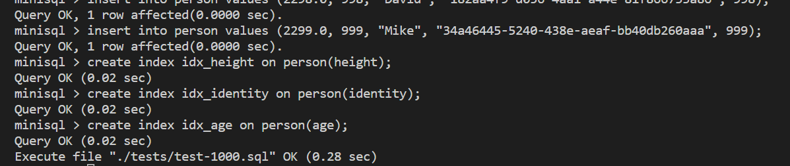
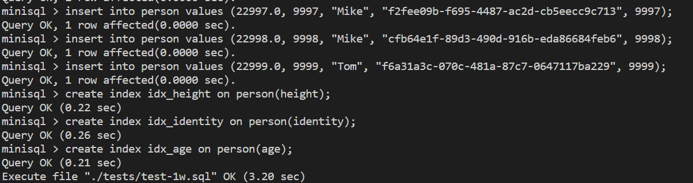
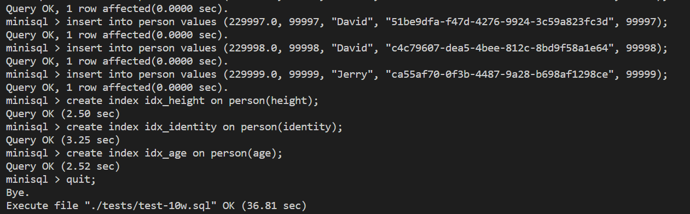

# MiniSQL总体设计报告

## 1.MiniSQL系统概述

### 1.1 背景

#### 1.1.1 编写目的

1. 设计并实现一个精简型单用户SQL引擎MiniSQL，允许用户通过字符界面输入SQL语句实现基本的增删改查操作，并能够通过索引来优化性能。
2. 通过对MiniSQL的设计与实现，提高学生的系统编程能力，加深对数据库管理系统底层设计的理解。

#### 1.1.2 项目背景

**(TODO)**

### 1.2 功能描述

以下为本*MiniSQL*所支持的操作与指令,其中与主流数据库( *MySQL*等 )同名的指令,功能和语法都与其相同,不再赘述.

* database

  * create database
  * drop database
  * use database
  * show databases

* table
  * create table
    * 支持的数据类型: *int, float, char(n)*
    * 支持的约束: *primary key, unique, not null*
  * drop table
  * show tables

* index
  * create index
    * 支持的索引类型: *B+树*
  * drop index
  * show indexes

* 表操作

  * select
  * insert
  * delete
  * update

* sql脚本
  * execfile:支持从文件中读取sql语句并执行
    * execfile "a.txt";

### 1.3 运行环境和配置

主要在*Windows*下的*WSL*中运行, 发行版为*Ubuntu 22.04*

* *gcc & g++* version: 11.3.0
* *cmake* version 3.22.1
* *GNU gdb* version 12.1

### 1.4 参考资料

1. https://www.yuque.com/yingchengjun/minisql
2. https://git.zju.edu.cn/zjucsdb/minisql

## 2. MiniSQL系统结构设计

### 2.1 总体设计

软件系统架构图如下:\


* 在系统架构中，解释器SQL Parser在解析SQL语句后将生成的语法树交由执行器Executor处理。执行器则根据语法树的内容对相应的数据库实例（DB Storage Engine Instance）进行操作。

* 每个DB Storage Engine Instance对应了一个数据库实例（即通过CREATE DATABSAE创建的数据库）。在每个数据库实例中，用户可以定义若干表和索引，表和索引的信息通过Catalog Manager、Index Manager和Record Manager进行维护。目前系统架构中已经支持使用多个数据库实例，不同的数据库实例可以通过USE语句切换（即类似于MySQL的切换数据库）.

### 2.2 DISK AND BUFFER POOL MANAGER

#### 2.2.1 位图页 Bitmap Page

位图页是Disk Manager模块中的一部分，是实现磁盘页分配与回收工作的必要功能组件。位图页与数据页一样，占用`PAGE_SIZE`（4KB）的空间，标记一段连续页的分配情况。

如下图所示，位图页由两部分组成，一部分是用于加速Bitmap内部查找的元信息（Bitmap Page Meta），它包含当前已经分配的页的数量（`page_allocated_`）以及下一个空闲的数据页(`next_free_page_`)。除去元信息外，页中剩余的部分就是Bitmap存储的具体数据，其大小`BITMAP_CONTENT_SIZE`可以通过`PAGE_SIZE - BITMAP_PAGE_META_SIZE`来计算。剩余部分中每一个bit都可以记录一个对应的页的分配情况。自然而然，这个Bitmap Page能够支持最多纪录`BITMAP_CONTENT_SIZE * 8`个连续页的分配情况。


#### 2.2.2 磁盘数据页管理

如下图所示，我们将一个位图页加一段连续的数据页看成数据库文件中的一个分区（Extent），再通过一个额外的元信息页来记录这些分区的信息，使得磁盘文件能够维护更多的数据页信息。


Disk Meta Page是数据库文件中的第0个数据页，它维护了分区相关的信息，包括已分配的Page数量（`num_allocated_pages_`）、已分配的分区数（`num_extents_`）、每个分区已分配的Page数量（`extent_used_page_`）。

为了便于后续设计，我们将页面的页号分为物理页号和逻辑页号。上层建筑中的页号都是逻辑页号，而磁盘文件中的页号都是物理页号。只有数据页拥有逻辑页号。假如每个分区能够支持3个数据页，则物理页号与逻辑页号的对应关系如下表所示：

| 物理页号 | 0 | 1 | 2 | 3 | 4 | 5 | 6 | ... |
| ------ | - | - | - | - | - | - | - | --- |
| 职责    | 磁盘元数据 | 位图页 | 数据页 | 数据页 | 数据页 | 位图页 | 数据页 | ... |
| 逻辑页号 | | | 0 | 1 | 2 | | 3 | ... |

#### 2.2.3 缓冲池管理

为了实现缓冲池管理，我们首先需要实现一个替换策略。在本次实验中，我们选择了LRU替换策略，以在缓冲池没有空闲页时决定替换哪一个数据页。LRU，即Least Recently Used，最近最少使用。在LRU替换策略中，我们维护一个链表，链表中的每一个节点都是一个数据页，链表的头部是最近使用的数据页，链表的尾部是最久未使用的数据页。当缓冲池中没有空闲页时，我们将链表尾部的数据页替换出去，将新的数据页插入到链表头部。为了改善链表随机读取$O(N)$的时间复杂度，我们可以采用一个`unordered_map<frame_id_t, list<frame_id_t>::iterator>`来存储链表中每个节点对应的迭代器，这样我们就可以在$O(1)$的时间复杂度内找到链表中的某个节点。

Buffer Pool Manager负责从Disk Manager中获取数据页并储存到内存中，并在必要时将脏页面转储到磁盘中（如需要为新的页面腾出空间）。在内存中，所有的页面都由`Page`对象表示，每个`Page`对象都包含了一段连续的内存空间`data_`和与该页相关的信息，包括逻辑页号（`page_id_`）、Pin Count（`pin_count_`）、脏页标记（`is_dirty_`）。如果固定（Pin）了一个页面，则该页面的Pin Count加一，如果解固定（Unpin）了一个页面，则该页面的Pin Count减一。如果一个页面的Pin Count为0，则该页面可以被替换出去。而决定一个页面是否需要被替换出去，则需要用到上述部分的LRU Replacer。

Buffer Pool Manager封装为`BufferPoolManager`类，对外的接口除了构造与析构函数外，主要包括以下几个：

* `Page *FetchPage(page_id_t page_id);`：从缓冲池中获取一个页面，如果该页面不在缓冲池中，则从磁盘中获取该页面。如果缓冲池中没有空闲页面，则需要使用LRU替换策略来决定替换哪一个页面。
* `bool UnpinPage(page_id_t page_id, bool is_dirty);`：解固定一个页面，如果该页面的Pin Count为0，则该页面可以被替换出去。如果该页面被修改过，则需要将该页面标记为脏页。
* `bool FlushPage(page_id_t page_id);`：将一个页面转储到磁盘中，如果该页面是脏页，则需要将该页面转储到磁盘中。
* `Page *NewPage(page_id_t &page_id);`：在缓冲池中分配一个新的页面，如果缓冲池中没有空闲页面，则需要使用LRU替换策略来决定替换哪一个页面。
* `bool DeletePage(page_id_t page_id);`：删除一个页面，如果该页面在缓冲池中，则需要将该页面从缓冲池中删除。

在后续的开发中，涉及到页面的操作都只需要通过`BufferPoolManager`类来完成。

### **2.3 RECORD MANAGER**

#### **2.3.1 RowID**

该class用来记录一条record的物理存储位置,即记录所在的页号和记录在该页中的序号.

主要作为*Row类*中的一个成员.

* 成员变量

    ```cpp
    page_id_t page_id_: 记录该条记录存储的页号,默认为*INVALID_PAGE_ID*
    uint32_t slot_num_: 记录该条record在该页中的序号
    ```

* 运算符重载
* 重载"=="来判断是否相同

* 成员函数

    ```cpp
    1. 构造函数
    2. inline page_id_t GetPageId();
        返回 page_id_
    3. inline uint32_t GetSlotNum();
        返回 slot_num_
    4. inline void Set(page_id_t page_id, uint32_t slot_num);
        设置实例的成员
    ```

#### **2.3.2 Field**

对应于一条记录中某一个字段的数据信息，如存储数据的数据类型，是否是空，存储数据的值等等；

与上文中的 `RowID`一样作为 `Row` 的重要成员.

* 成员变量

    ```cpp
    union Val {
    int32_t integer_;
    float float_;
    char *chars_;
    } value_;       //用来存储该属性的值
    TypeId type_id_;//枚举类,记录该属性的数据类型
                    //用来选择上面的value_中的哪一个
    uint32_t len_;  //记录该属性数据的占用空间
    bool is_null_{false};//记录该属性是否为NULL
    bool manage_data_{false};//表示是否需要自己删除该属性
    ```

#### **2.3.3 ROW**

与元组的概念等价，用于存储记录或索引键，一个`Row`由一个或多个`Field`构成。

* 成员变量

    ```cpp
    RowId rid_;//记录该条record的RowId,具体可见2.3.1
    std::vector<Field *> fields_//记录该条record的所有属性及值
    ```

* 成员函数

  * **SerializeTo**\
主要功能就是将当前record的各个属性序列化到输入的 `buf` 中,并且返回序列化字节长度.\
代码如下:

    ```cpp {.line-numbers}
    uint32_t Row::SerializeTo(char *buf, Schema *schema) const {
        ASSERT(schema != nullptr, "Invalid schema before serialize.");
        ASSERT(schema->GetColumnCount() == fields_.size(), "Fields size do not match schema's column size.");

        uint32_t ofs=sizeof(uint32_t);//记录位移量offset
        uint32_t cnt=this->GetFieldCount();//记录属性的数量

        uint32_t lenth=(cnt+31)/32;
        uint32_t *null_map=(uint32_t*)malloc(4*lenth);
        memset(null_map,0,4*lenth);

        memcpy(buf,&cnt,sizeof(uint32_t));
        ofs+=4*lenth;
        for(int i=0;i<cnt;i++){//遍历fields_
            if(fields_[i]->IsNull()){
                null_map[i/32]|=1<<(i%32);
            }else{
                ofs+=fields_[i]->SerializeTo(buf+ofs);
            }
        }
        memcpy(buf+4,null_map,4*lenth);
        
        return ofs;
    }
    ```

    值得注意的是,我用一个 `uint32_t` 的数组 `null_map` 来记录是否有某个属性为null,如果为null,将对应位设置为1,否则为0.在存放 `null_map` 的时候,我使用的是按位进行记录,也就是说每个属性的判断只占一个bit,减少了其序列化的空间消耗. 而 `lenth` 变量相当于$\lceil \frac{cnt}{32} \rceil$, 其中cnt,如注释所示,调用了`Row`的 `GetFieldCount` ,也就是返回成员 `fields_` 的size.\
    而后的for循环就是遍历整个 `fields_` . 对于其中不为Null的属性,调用 `Field` 的序列化函数写入,并且对ofs进行累加.\
    而对于Null的属性,将 `null_map` 中相应位置的树与移位后的数据做按位或的操作,从而将null信息记录.\
    最后将整个 `null_map` 写到 `buf` 中.

  * **DeserializeFrom 与 GetSerializedSize**\
    *DeserializeFrom* 其实就是对于 *SerializeTo* 的逆向操作,其返回值也是相当于序列化的长度\
    *GetSerializedSize* 就是将 *SerializeTo* 中的offset单独独立出来并返回大小.\
    两者都与上文有较高的重复性,所以不再赘述.

#### **2.3.4 TypeId**

简单的枚举类,用来判断该column的属性类型(`int, float, char`).

```cpp
enum TypeId { kTypeInvalid = 0, kTypeInt, kTypeFloat, kTypeChar, KMaxTypeId = kTypeChar };
```

#### **2.3.5 Column**

用于定义和表示数据表中的某一个字段，即包含了这个字段的字段名、字段类型、是否唯一等等

* 成员变量

    ```cpp
    std::string name_;//存储该列的属性名
    TypeId type_;     //存储该列的数据类型
    uint32_t len_{0};  //记录该列每个元素的占用空间
                        //对于char类型,记录最大长度占用的空间,而int和float则为对应size
    uint32_t table_ind_{0};  // 列在表中的序号
    bool nullable_{false};   // 该属性是否可为null
    bool unique_{false};     // 该属性的变量是否为unique
    ```

* 成员函数
  * **SerializeTo**\
主要功能就是将当前列的各个属性序列化到输入的 `buf` 中,并且返回序列化字节长度.\
代码如下:

    ```cpp
    uint32_t Column::SerializeTo(char *buf) const {
        uint32_t ofs=0;
        uint32_t name_lenth=name_.length();
        memcpy(buf,&name_lenth,4);
        ofs+=4;

        memcpy(buf+ofs,name_.c_str(),name_lenth);
        ofs+=name_lenth;

        memcpy(buf+ofs,&type_,4);
        ofs+=4;

        memcpy(buf+ofs,&len_,4);
        ofs+=4; 

        memcpy(buf+ofs,&table_ind_,4);
        ofs+=4; 

        memcpy(buf+ofs,&nullable_,sizeof(bool));
        ofs+=sizeof(bool);
        
        memcpy(buf+ofs,&unique_,sizeof(bool));
        ofs+=sizeof(bool);
        return ofs;
    }
    ```

    由于该类的成员都是较为固定的值,由此只需进行简单的写入即可.

  * **DeserializeFrom 与 GetSerializedSize**\
`DeserializeFrom` 其实就是对于 `SerializeTo` 的逆向操作,其返回值也是相当于序列化的长度\
`GetSerializedSize` 就是将 `SerializeTo` 中的offset单独独立出来并返回大小.\
两者都与上文有较高的重复性,所以不再赘述.

#### **2.3.6 Schema**

用于表示一个数据表或是一个索引的结构。一个 `Schema` 由一个或多个的Column构成

* 成员变量

```cpp
std::vector<Column *> columns_;//记录该表的所有列
bool is_manage_ = false; //是否需要在析构Schema时删除columns_中的元素
```

* 成员函数
  * 析构函数
如上文成员中所属,只有当 `is_manage_` 为true时才需要主动释放 `column_`

    ```cpp
    ~Schema() {
        if (is_manage_) {
            for (auto column : columns_) {
                delete column;
            }
        }
    }
    ```

  * **SerializeTo**\
将成员变量的信息序列化到 `buf` 中,并且返回序列化字节长度.\
其中调用了之前实现的 `Column` 的 `SerializeTo` 函数,将每个列的信息序列化到 `buf` 中.\

    ```cpp
    uint32_t Schema::SerializeTo(char *buf) const {
        uint32_t ofs=4;
        uint32_t col_cnt=columns_.size();
        memcpy(buf,&col_cnt,4);

        for(Column *t_col:columns_){
            ofs+=t_col->SerializeTo(buf+ofs);
        }
        return ofs;
    }
    ```

  * **DeserializeFrom 与 GetSerializedSize**\
与前面提及的两个类情况相同.

    以下是两个复制函数,由于对之后其他模块的使用有较大的作用,由此在这里重点提出.
  * **ShallowCopySchema**\
顾名思义,为浅拷贝,也就是返回的 `Schema` 中的 `columns_` 与当前传入实例中的是同一个,在析构时若不注意很有可能造成 `double free` 的bug. \
所以我们也可以看到最后创建 `Schema` 实例时,将 `is_manage_` 赋为false表示不用释放.

    ```cpp
    static Schema *ShallowCopySchema(const Schema *table_schema, const 
                                        std::vector<uint32_t> &attrs) {
        std::vector<Column *> cols;
        cols.reserve(attrs.size());
        for (const auto i : attrs) {
        cols.emplace_back(table_schema->columns_[i]);
        }
        return new Schema(cols, false);
    }
    ```

    可以看到在cols中插入的就是输入 `table_schema` 中的 `columns_` .

    同时,该函数主要在索引(index)相关的操作中被调用,由此其第二个输入的参数 `attrs` 中记录了`index` 中涉及列在 `table` 中的序号,所以输出的`schema`与输入的不同,通常是取部分列并改变顺序.

  * **DeepCopySchema**\
以下这个函数为`schema`的深拷贝,可以看到其在 `cols` 中插入的量都为新建的 `Column` 实例,不会与原schema产生 `double free` 的冲突.\
最后创建 `Schema` 实例时,将 `is_manage_` 赋为true表示需要手动释放.

    ```cpp
    static Schema *DeepCopySchema(const Schema *from) {
        std::vector<Column *> cols;
        for (uint32_t i = 0; i < from->GetColumnCount(); i++) {
            cols.push_back(new Column(from->GetColumn(i)));
        }
        return new Schema(cols, true);
    }
    ```

#### **2.3.7 TableHeap**

一种将记录以无序堆的形式进行组织的数据结构，不同的数据页（`TablePage`）之间通过双向链表连接。堆表中的记录通过 `RowId` 进行定位。`RowId` 记录了该行记录所在的 `page_id` 和 `slot_num`，其中 `slot_num` 用于定位记录在这个数据页中的下标位置。

* 成员变量

    ```cpp
    BufferPoolManager *buffer_pool_manager_;//缓冲池
    page_id_t first_page_id_; //记录该堆表的第一个数据页的页号
    Schema *schema_;       //该表的模式
    page_id_t last_active_page_id_ = INVALID_PAGE_ID;//记录上一个被操作(插入或删除)的页号
    [[maybe_unused]] LogManager *log_manager_;//未涉及
    [[maybe_unused]] LockManager *lock_manager_;//未涉及
    ```

* 成员函数
  * **InsertTuple**\
  向堆表中插入一条新数据,并修改该 `Row` 的 `RowId`.\
  以下代码进行了精简,具体可见相关文件.

    ```cpp
    if //row的序列化长度大于最大长度
        return false;
    
    //优先插入到上一个被操作的页中,若插入失败则插入到新的页中
    while (!page->InsertTuple){
        //插入失败
        //用page->GetNextPageId()获得其下一页
        if //下一页为无效页
            //创建新页并初始化
            //将新页插入到链表中
        else
            //获得下一页
    }
    //插入成功
    //将last_active_page_id_设置为当前pageId
    return true;
    ```

  * **UpdateTuple**\
  更新堆表中的一条数据,其中四种返回值(`int`)分别表示:
    1. 0 表示在当前页更新成功
    2. 1表示在当前页更新失败,但在其他页更新成功
    3. 2表示在当前页更新失败,且在其他页更新失败
    4. 3表示没有该 `RowId` 对应的数据

    ```cpp
    if(page->GetTupld){//找到该原始数据
        if(page->UpdateTuple){//更新成功
            return 0;
        }else{//更新失败
            if(this->InsertTuple(new_row)){//插入新数据
                //插入成功
                //MarkDelete原始数据
                return 1;
            }else{
                //插入失败
                return 2;
            }
        }
    }else{
        return 3;
    }
    ```

  * **GetTuple**\
  以输入的 `RowId` 为基础,从堆表中读取该条记录并返回.

    ```cpp
    bool TableHeap::GetTuple(Row *row, Transaction *txn) {
        // std::cout << "GetTuple" << std::endl;
        auto page = reinterpret_cast<TablePage *>(buffer_pool_manager_->
                                        FetchPage(row->GetRowId().GetPageId()));
        assert(page != nullptr);
        bool ret=page->GetTuple(row,schema_,txn,lock_manager_);
        ASSERT(ret, "Tuple not found!");
        buffer_pool_manager_->UnpinPage(row->GetRowId().GetPageId(),false);
        return ret;
    }
    ```

  * **DeleteTable**\
  释放该堆表的所有占用空间.

    ```cpp
    void TableHeap::DeleteTable(page_id_t page_id) {
        if (page_id != INVALID_PAGE_ID) {
            auto temp_table_page = reinterpret_cast<TablePage *>
                                (buffer_pool_manager_->FetchPage(page_id)); 
            if (temp_table_page->GetNextPageId() != INVALID_PAGE_ID)
                DeleteTable(temp_table_page->GetNextPageId());
            buffer_pool_manager_->UnpinPage(page_id, false);
            buffer_pool_manager_->DeletePage(page_id);
        } else {
            DeleteTable(first_page_id_);
        }
    }
    ```
  
  * **Begin**与**End**\
    用于创建堆表的迭代器,并返回.\
    `Begin` 的思路就是从堆表的第一页开始遍历所有页,直到找到第一条记录,最后将该 `Row` 作为迭代器的成员变量返回.\
    `End` 的思路就是创建一个空(非法)的 `Row` 作为迭代器的成员变量返回.

      ```cpp
      TableIterator TableHeap::Begin(Transaction *txn) {
        RowId row_id;
        page_id_t pageId=first_page_id_;
        TablePage *page = nullptr;
        bool found= false;
        while(pageId!=INVALID_PAGE_ID){//遍历堆表的所有页
            page=reinterpret_cast<TablePage *>(buffer_pool_manager_->FetchPage(pageId));
            found = page->GetFirstTupleRid(&row_id);//寻找当前页的第一条记录
            page_id_t next_page_id=page->GetNextPageId();
            buffer_pool_manager_->UnpinPage(pageId, false);
            if(found){
                break;
            }
            pageId=next_page_id;
        }
        if(found){//找到记录,返回对应的迭代器
            Row ret_row(row_id);
            if(row_id.GetPageId()!=INVALID_PAGE_ID){
                this->GetTuple(&ret_row,nullptr);
            }
            return TableIterator(new Row(ret_row), this);
        }else{//如果没有记录,就返回End
            return this->End();
        }
      }

      TableIterator TableHeap::End() {
        return TableIterator(new Row(INVALID_ROWID), this);
      }
      ```

#### **2.3.8 TableIterator**

堆表的迭代器,用来访问表中的每一条数据.

* 成员变量

    ```cpp
    Row *row_;//记录当前record的值
    TableHeap *table_heap_;//记录当前所在堆表
    ```

* 成员函数
  * **构造函数**
    1. 初始化列表\
    十分便于理解,直接将传入的值赋给该迭代器.

        ```cpp
        TableIterator::TableIterator(Row* row_,TableHeap *table_heap_):
                                    row_(row_),table_heap_(table_heap_) {}
        ```

    2. 拷贝构造\
    值得注意的是,此处用传入的 `other.row_` 新建了一个 `Row` 实例,也是为了防止 `double free` 的发生.

        ```cpp
        TableIterator::TableIterator(const TableIterator &other) {
            this->row_=new Row(*other.row_);
            this->table_heap_=other.table_heap_;
        }
        ```

  * **析构函数**\
    删除 `row_` ,由于构造时就是新建了 `Row` 实例,所以不会 `double free`

    ```cpp
    TableIterator::~TableIterator() {
        delete row_;
    }
    ```

  * 重载运算符
    1. `==` 与 `!=`\
    通过判断两个迭代器的记录的 `RowId` ,也就是其物理地址来判断迭代器是否相同

        ```cpp
        bool TableIterator::operator==(const TableIterator &itr) const {
            if(!(this->row_->GetRowId()==itr.row_->GetRowId())) 
                return false;
            return true;
        }

        bool TableIterator::operator!=(const TableIterator &itr) const {
            return !((*this)==itr);
        }
        ```

    2. `*` 与 `->`\
    都是返回相应的 `row_`成员

        ```cpp
        const Row &TableIterator::operator*() {
            return *row_;
        }

        Row *TableIterator::operator->() {
            return row_;
        }
        ```

    3. `=`\
    与拷贝构造同理

        ```cpp
        TableIterator &TableIterator::operator=(const TableIterator &itr) noexcept {
            this->row_= new Row(*(itr.row_));
            this->table_heap_=itr.table_heap_;
            return *this;
        }
        ```

    4. 自增运算符`++`\
    返回下一条record的迭代器,若已经是最后一条则返回无效迭代器.

        ```cpp
        //get current_page from current iterator
        if current_page has next record
            return next record's iterator
        else
            //获得当前页的下一页next_page
            while next_page has no first record
                if next_page is the last page
                    return invalid iterator
                else
                    next_page = next_page's next page
            //获得next_page的第一条记录的RowId
            //将当前迭代器实例的row_指向该RowId并从堆表中获取数据
            return *this;
        return invalid iterator
        
        ```


### 2.4 INDEX MANAGER

#### 2.4.1 B+树数据页

B+树中每个节点都对应一个数据页。我们首先实现了一个内部节点和叶子节点所需要的公共父类`BPlusTreePage`，它包括了中间节点`BPlusTreeInternalPage`与叶子节点`BPlusTreeLeafPage`的共同部分，包括：

* `page_type_`: 标记数据页是中间结点还是叶子结点；
* `key_size_`: 当前索引键的长度，
* `lsn_`: 数据页的日志序列号，目前不会用到，如果之后感兴趣做Crash Recovery相关的内容需要用到；
* `size_`: 当前结点中存储Key-Value键值对的数量；
* `max_size_`: 当前结点最多能够容纳Key-Value键值对的数量；
* `parent_page_id_`: 父结点对应数据页的page_id;
* `page_id_`: 当前结点对应数据页的page_id。

对于中间节点，由于不储存数据，只需要按照顺序存储$m$个键和$m+1$个指针（这些指针记录的是子结点的`page_id`）。由于键和指针的数量不相等，因此我们需要将第一个键设置为INVALID，也就是说，顺序查找时需要从第二个键开始查找。在任何时候，每个中间结点至少是半满的（Half Full）。当删除操作导致某个结点不满足半满的条件，需要通过合并（Merge）相邻两个结点或是从另一个结点中借用（移动）一个元素到该结点中（Redistribute）来使该结点满足半满的条件。当插入操作导致某个结点溢出时，需要将这个结点分裂成为两个结点。在B+树中，键的类型为`GenericKey`，它由`KeyManager`对`Row`类型的键进行序列化而得到，并可以通过`KeyManager`对两个`GenericKey`进行比较。

对于叶子节点，其存储实际的数据，按照顺序存储$m$个键和$m$个值。其值为`RowId`。叶结点和中间结点一样遵循着键值对数量的约束，同样也需要完成对应的合并、借用和分裂操作。

#### 2.4.2 B+树索引

我们所设计的B+树只支持`Unique Key`。上述完成的B+树数据页需要通过`BPlusTree`类来进行管理。`BPlusTree`类中包括了插入、删除、合并、借用和分裂等操作。提供给外部的接口如下：

* `bool IsEmpty()`: 判断B+树是否为空；
* `bool Insert(GenericKey *key, const RowId &value, Transaction *transaction = nullptr)`：插入键值对，如果键已经存在，则返回false，否则返回true；
* `void Remove(const GenericKey *key, Transaction *transaction = nullptr)`：删除键值对；
* `bool GetValue(const GenericKey *key, std::vector<RowId> &result, Transaction *transaction = nullptr)`：根据键查找对应的值，并将结果存储在`result`中。如果键不存在，则返回false，否则返回true；
* `IndexIterator Begin(const GenericKey *key);`：返回第一个键值对的迭代器；
* `IndexIterator End();`：返回最后一个键值对的迭代器；
* `void Destroy(page_id_t current_page_id = INVALID_PAGE_ID);`：销毁B+树，如果`current_page_id`为`INVALID_PAGE_ID`，则销毁整棵树，否则销毁以`current_page_id`为根的子树。

#### 2.4.3 B+树索引迭代器

B+树迭代器`IndexIterator`用来遍历B+树中的键值对。主要的成员变量为当前的page_id（`current_page_id`）与在该叶子节点页面中的索引值（`item_index`）。主要通过重载以下几个操作符来实现迭代器的功能：

* `std::pair<GenericKey *, RowId> operator*()`：返回当前键值对；
* `IndexIterator &operator++()`：将迭代器指向下一个键值对；
* `bool operator==(const IndexIterator &itr) const`：判断两个迭代器是否相等；
* `bool operator!=(const IndexIterator &itr) const`：判断两个迭代器是否不相等。

在后续的开发中，我们只需要通过`BPlusTree`类的`Begin`和`End`方法来获取迭代器，然后通过迭代器来遍历B+树中的键值对。

### **2.5 CATALOG MANAGER**

Catalog Manager 负责管理和维护数据库的所有模式信息，包括：

* 数据库中所有表的定义信息，包括表的名称、表中字段（列）数、主键、定义在该表上的索引。
* 表中每个字段的定义信息，包括字段类型、是否唯一等。
* 数据库中所有索引的定义，包括所属表、索引建立在那个字段上等。

这些模式信息在被创建、修改和删除后还应被持久化到数据库文件中。此外，`Catalog Manager` 还需要为上层的执行器 `Executor` 提供公共接口以供执行器获取目录信息并生成执行计划。

#### **2.5.1 TableMetadata**

记录表的元数据,包括表名,表的序号,表的模式,表的根页号.

* 成员变量

    ```cpp
    table_id_t table_id_;//记录当前table在数据库中的序号
    std::string table_name_;//记录当前table的名字
    page_id_t root_page_id_;//记录tableheap的首个数据页页号
    Schema *schema_;//记录该table的模式
    ```

* 成员函数
  * **GetSerializedSize**\
    在原框架中已经实现了 `SerializeTo` 的情况下,写一个 `GetSerializedSize` 函数就十分简单了,只需要将其中 `buf` 的移动长度总和都记录下来即可.

    ```cpp
    uint32_t TableMetadata::GetSerializedSize() const {
        uint32_t ret=16+table_name_.length()+schema_->GetSerializedSize();
        return ret;
    }
    ```

    其中16是直接计算了固定长度的成员的占用空间,再加上不定长的表名与模式的占用空间即可.

#### **2.5.2 TableInfo**

记录表的信息,包括其元数据与堆表.

* 成员变量

    ```cpp
    TableMetadata *table_metadata_;//记录表的元数据
    TableHeap *table_heap_;//记录表的堆表
    ```

#### **2.5.3 IndexMetadata**

记录索引的元数据,包括索引名,索引的序号,索引所在的表的序号,索引所在的列的序号.

* 成员变量

    ```cpp
    index_id_t index_id_;//记录当前索引在数据库中的序号
    std::string index_name_;//记录当前索引的名字
    table_id_t table_id_;//记录当前索引所在的表的序号
    std::vector<uint32_t> key_map_;//记录当前索引所在的列的序号
    ```

* 成员函数
  * **GetSerializedSize**\
  与上文中的 `TableMetadata` 类似,只需要将其中 `buf` 的移动长度总和都记录下来即可.

    ```cpp
    uint32_t IndexMetadata::GetSerializedSize() const {
        uint32_t ret=20+index_name_.length()+key_map_.size()*4;

        return ret;
    }
    ```

#### **2.5.4 IndexInfo**

包含了这个索引定义时的元信息 `meta_data_`，该索引对应的表信息 `table_info_`，该索引的模式信息 `key_schema_` 和索引操作对象 `index_`. 其中除了 `meta_data_` 以外，其他三个信息都是通过反序列化后的元数据生成的.

* 成员变量\
值得注意的是,下面的 `index_` 其实是 `Index` 的子类 `BPlusTreeIndex` 的实例.

    ```cpp
    IndexMetadata *meta_data_;//记录索引的元数据
    Index *index_;//索引操作对象
    IndexSchema *key_schema_;//记录索引的模式
    ```

* 成员函数
  * **Init**\
    使用传入的 `meta_data_` 与 `table_info_` 初始化 `key_schema_` 与 `index_`.

      ```cpp
        void Init(IndexMetadata *meta_data, TableInfo *table_info, 
              BufferPoolManager *buffer_pool_manager) {
          // Step1: init index metadata and table info
          // Step2: mapping index key to key schema
          // Step3: call CreateIndex to create the index  
          this->meta_data_=meta_data;
          key_schema_=Schema::ShallowCopySchema(table_info->GetSchema(),
                                              meta_data_->GetKeyMapping());
          index_=CreateIndex(buffer_pool_manager,"bptree");
      }
      ```

#### **2.5.5 CatalogMeta**

记录了整个数据库的元数据,包括其包含的表的元数据与索引的元数据.

* 成员变量\
其中的两个 `map` 分别记录了每张 `table` 与其元数据存储页号的映射,以及每个索引与其元数据存储页号的映射.

    ```cpp
    std::map<table_id_t, page_id_t> table_meta_pages_;
    std::map<index_id_t, page_id_t> index_meta_pages_;
    ```

* 成员函数
  * **GetSerializedSize**\
  由于其基本上都是定长,所以可以直接计算,而两个 `map` 的映射也可以通过 `map size` 快速计算.

    ```cpp
    uint32_t CatalogMeta::GetSerializedSize() const {
        uint32_t ret=12+table_meta_pages_.size()*8+index_meta_pages_.size()*8;
        return ret;
    }
    ```

    并且,由于原框架中没有对上述两个成员变量的添加的功能,所以在这个地方我自己添加了下面两个函数来操作.

  * **AddTableMetaPage**与**AddIndexMetaPage**\
   函数实现非常简单,不多赘述.

    ```cpp
    void AddTableMetaPage(table_id_t table_id,page_id_t page_id){
        table_meta_pages_.emplace(table_id,page_id);
    }

    void AddIndexMetaPage(index_id_t index_id,page_id_t page_id){
        index_meta_pages_.emplace(index_id,page_id);
    }
    ```

#### **2.5.6 CatalogManager**

具备维护和持久化数据库中所有表和索引的信息。`CatalogManager` 能够在数据库实例（`DBStorageEngine`）初次创建时（`init = true`）初始化元数据；并在后续重新打开数据库实例时，从数据库文件中加载所有的表和索引信息，构建 `TableInfo` 和 `IndexInfo` 信息置于内存中。此外， `CatalogManager` 类还需要对上层模块提供对指定数据表的操作方式，如`CreateTable`、`GetTable`、`GetTables`、`DropTable`、`GetTableIndexes`；对上层模块提供对指定索引的操作方式，如`CreateIndex`、`GetIndex`、`DropIndex`。

* 成员变量

    ```cpp
    [[maybe_unused]] BufferPoolManager *buffer_pool_manager_;
    [[maybe_unused]] LockManager *lock_manager_;
    [[maybe_unused]] LogManager *log_manager_;
    CatalogMeta *catalog_meta_;//存储该数据库的元数据
    std::atomic<table_id_t> next_table_id_; //记录下一个插入的table的id
    std::atomic<index_id_t> next_index_id_; //记录下一个插入的index的id
    // map for tables
    std::unordered_map<std::string, table_id_t> table_names_;//table name和id的映射
    std::unordered_map<table_id_t, TableInfo *> tables_;//table id和info的映射
    // map for indexes: table_name->index_name->indexes
    std::unordered_map<std::string, std::unordered_map<std::string, index_id_t>> index_names_;//记录一个table中的所有index
    std::unordered_map<index_id_t, IndexInfo *> indexes_;//index id和info的映射
    ```

* 成员函数
  * 构造函数\
如前面所述,该构造函数有两个情况,初次创建（`init = true`）和重新打开数据库实例.\
对于初次创建时,由于新数据库中没有 `table` 也没有 `index` ,所以只需要初始化一个空的 `CatalogMeta` 并将其序列化到磁盘即可.\
而在重新打开数据库的时候,则需要先将 `catalog` 的元数据反序列化出来. 然后通过 `catalog_meta` 将各个 `table` 和 `index` 加载出来,其中涉及的 `LoadTable` 和 'LoadIndex` 会在后文说明.

    ```cpp
    CatalogManager::CatalogManager(BufferPoolManager *buffer_pool_manager, 
                LockManager *lock_manager,LogManager *log_manager, bool init): 
                buffer_pool_manager_(buffer_pool_manager), lock_manager_(lock_manager),
                log_manager_(log_manager) {
        if(init){
            catalog_meta_=CatalogMeta::NewInstance();
            auto page = buffer_pool_manager_->FetchPage(CATALOG_META_PAGE_ID);
            catalog_meta_->SerializeTo(page->GetData());
            buffer_pool_manager_->UnpinPage(CATALOG_META_PAGE_ID, true);
            return ;
        }else{
            Page *cata_page=buffer_pool_manager_->FetchPage(CATALOG_META_PAGE_ID);
            catalog_meta_ = CatalogMeta::DeserializeFrom(cata_page->GetData());

            std::map<table_id_t, page_id_t> table_meta_page=
                                        *(catalog_meta_->GetTableMetaPages());
            std::map<index_id_t ,page_id_t >index_meta_page=
                                        *(catalog_meta_->GetIndexMetaPages());

            for(auto &itr:table_meta_page){
                LoadTable(itr.first,itr.second);
            }
            for(auto &itr:index_meta_page){
                LoadIndex(itr.first,itr.second);
            }
            buffer_pool_manager_->UnpinPage(CATALOG_META_PAGE_ID, false);
        }
    }

    ```

  * **GetTable**\
  这有两个重载函数,一个输入 `table_name` ,一个输入 `table_id`. 第一个是 `public` 第二个是 `private`.\
  两者实现原理差不多,都是通过输入的 `table_name/table_id` 来查找相应的 `TableInfo` ,并赋值给传入的引用 `table_info`.\
  最后还有一个 `GetTables`, 作用是返回所有现有 `table` 的 `TableInfo`. 原理也类似.

    ```cpp
    dberr_t CatalogManager::GetTable(const string &table_name, 
                                        TableInfo *&table_info) {
        auto table=table_names_.find(table_name);
        if(table==table_names_.end()){
            return DB_TABLE_NOT_EXIST;
        }else{
            table_info=tables_.find(table->second)->second;
            return DB_SUCCESS;
        }
    }

    dberr_t CatalogManager::GetTable(const table_id_t table_id, 
                                    TableInfo *&table_info) {
        auto tmp=tables_.find(table_id);
        if(tmp==tables_.end()){
            return DB_TABLE_NOT_EXIST;
        }else{
            table_info=tmp->second;
            return DB_SUCCESS;
        }
    }

    dberr_t CatalogManager::GetTables(vector<TableInfo *> &tables) const {
        for(auto itr:tables_){
            tables.push_back(itr.second);
        }
        return DB_SUCCESS;
    }
    ```

  * **CreateTable**\
  顾名思义是用来新建表的.由于代码过长,不直接贴代码,具体实现可以查看相应文件.

    ```cpp
    //input: table_name,schema
    //result: 执行状态
    if table_name not in table_names_
        //在缓冲池中New一个page
        //用next_table_id_为其获得一个id,并对成员加1
        //创建该table的堆表和元数据
        //插入catalog_meta中并序列化.
        //return DB_SUCCESS;
    else
        //return DB_TABLE_ALREADY_EXIST;
    ```

  * **DropTable**\
  顾名思义是从数据库中删除某张表.

    ```cpp
    //input: table_name
    //result: 执行状态
    if table_name not in table_names_
        //return DB_TABLE_NOT_EXIST;
    else
        //释放其对应堆表所占用的页
        //从catalog_meta中删除其对应的index和table
        //将catalog_meta 重新序列化
        //return DB_SUCCESS;
    ```

  * **LoadTable**\
  从磁盘中反序列化出table的元数据以及获得其info和tableheap.

    ```cpp
    //input: const table_id, const page_id
    //return: 执行状态

    if(FetchPage(page_id))
        //调用TableMetadata的反序列化函数
        //以table_meta为基础构造出tableheap和tableinfo
        //插入到catalog_meta中
        //return DB_SUCCESS;
    else
        //return DB_FAILED;
    ```

  * **GetIndex**\
  与 `GetTable` 类似,只是涉及的相关数据类型不同.

    ```cpp
    dberr_t CatalogManager::GetIndex(const std::string &table_name, const std::string &index_name,
                                 IndexInfo *&index_info) const {
        auto table=index_names_.find(table_name);
        if(table==index_names_.end()){
            return DB_TABLE_NOT_EXIST;
        }else{
            auto index=table->second.find(index_name);
            if(index==table->second.end()){
                return DB_INDEX_NOT_FOUND;
            }else{
                index_info=indexes_.find(index->second)->second;
                return DB_SUCCESS;
            }
        }
    }
    ```

  * **CreateIndex**\
  在指定表中新建一个指定模式的索引.

    ```cpp
    dberr_t CatalogManager::CreateIndex(const std::string &table_name, const string &index_name,
                                    const std::vector<std::string> &index_keys, Transaction *txn,
                                    IndexInfo *&index_info, const string &index_type) {
        if(table_name in table_names_){
            if(index_name in index_names_){
                return DB_INDEX_ALREADY_EXIST;
            }else{
                //根据所给的index_keys,从该table的schema中分别找出对应的列号存在key_map中
                //根据成员中的next_index_id_获得其id
                //以key_map和该tableinfo为基础创建index_meta
                //NewPage来存储index_meta
                //以此为基础构造index_info
                //插入到catalog_meta中
                //flush catalog_meta
            }
        }else{
            return DB_TABLE_NOT_EXIST;
        }
    }
    ```

  * **DropIndex**\
  也是与 `table` 相似,具体实现可见相关代码.

    ```cpp
    //input: const table_name, const index_name
    //return: 执行状态

    if(index_name exists in table_name)
        //delete it from catalog_meta
        //释放该index在磁盘中的占用
        //重新序列化catalog_meta
        //return DB_SUCCESS;
    else
        //return DB_INDEX_NOT_FOUND;
    ```

  * **GetTableIndexes**\
  获得指定`table`的所有`index`的`info`.\
  先在`catalog`中找到相应的`table`,再遍历其所有的`index`.

    ```cpp
    dberr_t CatalogManager::GetTableIndexes(const std::string &table_name, 
                                        std::vector<IndexInfo *> &indexes) const {
        auto tmp=index_names_.find(table_name);
        if(tmp==index_names_.end()){
            return DB_TABLE_NOT_EXIST;
        }else{
            for(auto &itr:tmp->second){
                indexes.push_back(indexes_.find(itr.second)->second);
            }
            return DB_SUCCESS;
        }
    }
    ```

  * **LoadIndex**\
  与'table' 类似.

    ```cpp
    //input: const index_id, const page_id
    //return: 执行状态

    if(FetchPage(page_id))
        //调用IndexMetadata的反序列化函数
        //以index_meta为基础构造出indexheap和indexinfo
        //插入到catalog_meta中
        //return DB_SUCCESS;
    else
        //return DB_FAILED;
    ```

  * **FlushCatalogMetaPage**\
  把当前的 `catalog_meta` 序列化到磁盘中,持久化.

    ```cpp
    dberr_t CatalogManager::FlushCatalogMetaPage() const {
        Page *cata_page=buffer_pool_manager_->FetchPage(CATALOG_META_PAGE_ID);
        catalog_meta_->SerializeTo(cata_page->GetData());
        buffer_pool_manager_->UnpinPage(CATALOG_META_PAGE_ID, true);
        buffer_pool_manager_->FlushPage(CATALOG_META_PAGE_ID);
        return DB_SUCCESS;
    }
    ```

### 2.6 PLANNER AND EXECUTOR

#### 2.6.1 Parser生成语法树

在本实验提供的代码中已经设计好了Parser模块，其生成的语法树数据结构如下：

```cpp
/**
 * Syntax node definition used in abstract syntax tree.
 */
struct SyntaxNode {
  int id_;    /** node id for allocated syntax node, used for debug */
  SyntaxNodeType type_; /** syntax node type */
  int line_no_; /** line number of this syntax node appears in sql */
  int col_no_;  /** column number of this syntax node appears in sql */
  struct SyntaxNode *child_;  /** children of this syntax node */
  struct SyntaxNode *next_;   /** siblings of this syntax node, linked by a single linked list */
  char *val_; /** attribute value of this syntax node, use deep copy */
};
typedef struct SyntaxNode *pSyntaxNode;
```

例如，对于`select * from t1 where id = 1 and name = "str";`这一条SQL语句，生成的语法树如下图所示：


#### 2.6.2 Planner生成查询计划

Planner部分需要先遍历语法树，并调用Catalog Manager检查语法树中的信息是否正确，如表、列是否存在，谓词的值类型是否与column类型对应等等，随后将这些词语抽象成相应的表达式。解析完成后，Planner根据改写语法树后生成的可以理解的Statement结构，生成对应的Plannode，并将Planndoe交由executor进行执行。

#### 2.6.3 Executor执行查询计划

在本次实验中，我们采用的算子的执行模型为火山模型。执行引擎会将整个 SQL 构建成一个 Operator 树，查询树自顶向下的调用接口，数据则自底向上的被拉取处理。每一种操作会抽象为一个 Operator，每个算子都有 `Init()` 和 `Next()` 两个方法。`Init()` 对算子进行初始化工作。`Next()` 则是向下层算子请求下一条数据。当 `Next()` 返回 false 时，则代表下层算子已经没有剩余数据，迭代结束。

本次实验我们实现了select、index select、insert、update、delete五个算子。 对于每个算子，都实现了 Init 和 Next 方法。 Init 方法初始化运算符的内部状态，Next 方法提供迭代器接口，并在每次调用时返回一个元组和相应的 RID。对于每个算子，我们假设它在单线程上下文中运行，并不需要考虑多线程的情况。每个算子都可以通过访问 ExecuteContext来实现表的修改，例如插入、更新和删除。 为了使表索引与底层表保持一致，插入删除时还需要更新索引。

* SeqScanExecutor 对表执行一次顺序扫描，一次Next()方法返回一个符合谓词条件的行。顺序扫描的表名和谓词（Predicate）由SeqScanPlanNode 指定。
* IndexScanExecutor 对表执行一次带索引的扫描，一次Next()方法返回一个符合谓词条件的行。为简单起见，IndexScan仅支持单列索引。
* InsertExecutor 将行插入表中并更新索引。要插入的值通过ValueExecutor生成对应的行，随后被拉取到InsertExecutor中。
* ValueExecutor主要用于insert into t1 values(1, "aaa", null, 2.33);语句。插入的值以vector形式存储在ValuesPlanNode中，ValueExecutor调用Next()方法一次返回一个新的行。
* UpdateExecutor 修改指定表中的现有行并更新其索引。UpdatePlanNode 将有一个 SeqScanPlanNode 作为其子节点，要更新的值通过SeqScanExecutor提供。
* DeleteExecutor 删除表中符合条件的行。和Update一样，DeletePlanNode 将有一个 SeqScanPlanNode 作为其子节点，要删除的值通过SeqScanExecutor提供。

除了以上几个算子，我们还需要实现创建删除查询数据库、数据表、索引，执行文件中的SQL语句等函数。由于这些操作对应的语法树较为简单，因此不用通过Planner生成查询计划。

Executor模块的具体执行过程隐藏为private成员函数，外部只需要调用`dberr_t Execute(pSyntaxNode ast);`接口，传入语法树根节点，来执行对应的操作。

## 3.测试方案和测试样例

### 3.1 函数测试

首先是采用*MiniSQL*提供的*test*文件夹中的测试样例进行测试,主要用来测试该数据库内部各个函数是否运行正确,测试结果如下:


其中主要分为以下几个模块:

* *BufferPoolManagerTest*
  * BinaryDataTest
    主要用来测试*BufferPoolManager*的基本功能:
    * 新建页*NewPage*,并在达到最大页数时返回*nullptr*
    * 修改页中数据并可再次读取
    * 在*UnpinPage*之后,可以用*NewPage*将该页替换掉

* *LRUReplacerTest*
  * SampleTest
    * 与上文(*BufferPoolManager*)中测试相似,只是此处采用了*LRUReplacer*作为*BufferPoolManager*的替换策略,也就是说,当*BufferPoolManager*中的页数达到最大时,会将最近最少使用的页替换掉.
* *DiskManagerTest*
  作为*BufferPoolManager*真正接触磁盘的中间类,用来实现真正的磁盘读写操作,主要测试了以下几个功能:
  * BitMapPageTest
  * FreePageAllocationTest
* *TupleTest*
  * FieldSerializeDeserializeTest
    主要用来测试*Field*类的序列化和反序列化
  * RowTest
    主要用来测试Tuple(Row)的插入与删除,主要是通过*TablePage*这个类作为调用端,调用Row中的序列化和反序列化函数,将Row插入到*TablePage*中;然后再将Row中的数据反序列化出来,与原来的数据进行比较,看是否相同;最后再从*TablePage*中删除Row,
* *TableHeapTest*
  * TableHeapSampleTest
    主要是用来测试*TableHeap*该类的插入与获取Tuple的功能. 与上文中(*TupleTest::RowTest*)仅仅测试一条数据不同,这里测试了较大数据规模(10000条)的插入与查询,并且在插入时,覆盖了三种所支持的数据类型(*int,float,char*).
* *BPlusTreeTests*
  * IndexGenericKeyTest
  * IndexSimpleTest
  * SampleTest
    向B+树中插入数据,并且在初始化数据之后采用shuffle打乱来模拟索引后的顺序,最后再进行查询,看是否能够正确的查询到数据.
  * IndexIteratorTest
* *PageTests*
  * IndexRootsPageTest
    主要是用来测试*IndexRootsPage*类的插入、获取、删除功能.并且查看获取的数据的正确性.
* *CatalogTest*
  * CatalogMetaTest
    主要测试*CatalogMeta*类的序列化和反序列化功能
  * CatalogTableTest
  * CatalogIndexTest
    上面两个测试方法相似,只是测试的对象不同,一个是*Table*,一个是*Index*.

    其中心思想都是先创建一个数据库实例,并对该实例中的catalogMeta进行操作(createTable和CreateIndex),然后再将该实例序列化到磁盘中,再从磁盘中反序列化出来,看是否与原来的相同.
* *ExecutorTest*
  以下的4个测试都是在setup初始化之后的这个数据库中进行操作的,在初始化中,向表中插入了1000条数据,表定义如下:

  ```sql
  create table table-1(id int,
                       name char(64),
                       account float);
  ```

  * SeqScanTest
    测试*select*功能:SELECT id FROM table-1 WHERE id < 500;
  * DeleteTest
    测试*delete*功能:DELETE FROM table-1 WHERE id == 50;
  * RawInsertTest
    测试*insert*功能:INSERT INTO table-1 VALUES (1001, "aaa", 2.33);
  * UpdateTest
    测试*update*功能:UPDATE table-1 SET name = "minisql" where id = 500;

### 3.2 数据库测试

该模块则是对最后生成的数据库系统进行测试,主要是测试数据库的基本功能,包括*select,insert,delete,update*等功能.

由于涉及语句较多,由此此处主要采用*sql*文件的形式进行测试,并使用*execfile*指令调用

* table的create/drop功能

  ```sql
  create table person ( 
    height float,
    pid int,
    name char(32),
    identity char(128),
    age int unique,
    primary key(pid)
  );

  insert into person values (1300.0, 0, "Tom", "cf0a2386-2435-423f-86b8-814318bedbc7", 0);

  drop table person;
  ```

  结果如下,成功运行:
  
* table的insert/delete功能
  此处有两组不同的delete语句,测试中是分别测试的:
  
  ```sql
  create table person ( 
    height float,
    pid int,
    name char(32),
    identity char(128) unique,
    age int,
    primary key(pid)
  );
  <!-- 插入20条数据 -->

  <!-- 第一组删除语句 -->
  delete from person where pid = 15;
  delete from person where height = 173.5;
  delete from person where age = 20 and height > 175.5;
  delete from person where height = 175.1;
  delete from person where name = "Person20";
  delete from person where identity = "000017";
  delete from person where identity = "000016" and age = 29;

  <!-- 第二组删除语句 -->
  delete from person where pid >= 15;
  delete from person where height < 173.5;
  delete from person where age <= 20 and height < 170 and identity = "000016";
  delete from person where age <= 20 and height >= 175;
  delete from person where age <= 20 and height < 170 and name = "Person16";

  <!-- 最后查询与drop相同 -->
  select * from person;

  drop table person;
  ```

  结果如下:
  * 第一组删除语句:
  
  * 第二组删除语句:
  

* table的select功能
  与上文一样,也有两组不同的查询语句:

  ```sql
  create table person ( 
    height float,
    pid int,
    name char(32),
    identity char(128) unique,
    age int,
    primary key(pid)
  );
  <!-- 插入20条数据 -->

  <!-- 第一组查询语句 -->
  select * from person where pid = 15;
  select * from person where height = 173.5;
  select * from person where age = 20 and height > 175.5;
  select * from person where height = 175.1;

  <!-- 第二组查询语句 -->
  select * from person where pid >= 15;
  select * from person where height < 173.5;
  select * from person where age <= 20 and height < 170;

  <!-- 最后都drop掉 -->
  drop table person;
  ```
  
  结果如下:
  * 第一组查询语句:
  
  * 第二组查询语句:
  
* index的create/drop功能

  ```sql
  create table person ( 
    height float unique,
    pid int,
    name char(32),
    identity char(128) unique,
    age int unique,
    primary key(pid)
  );
  <!-- 插入一定量的数据(此处20条),为节省空间省略 -->
  create index idx_height on person(height);
  create index idx_identity on person(identity);
  create index idx_age on person(age);

  select * from person where age > 24;
  select * from person where identity = "Person15";
  select * from person where height <= 176.3;

  drop index idx_height;
  drop index idx_identity;
  drop index idx_age;

  drop table person;
  ```

  结果如下:
  
* 压力测试
  分别向表中插入1000,1w,10w条数据,并在插入之后create index.

  结果如下:
    * 1000
    
    * 1w
    
    * 10w
    

## 4.分组与设计分工
