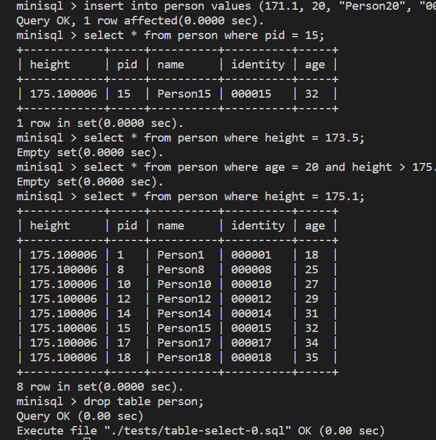

# MiniSQL总体设计报告

## 1.MiniSQL系统概述

### 1.1 背景

#### 1.1.1 编写目的

1. 设计并实现一个精简型单用户SQL引擎MiniSQL，允许用户通过字符界面输入SQL语句实现基本的增删改查操作，并能够通过索引来优化性能。
2. 通过对MiniSQL的设计与实现，提高学生的系统编程能力，加深对数据库管理系统底层设计的理解。

#### 1.1.2 项目背景

**(TODO)**

### 1.2 功能描述

以下为本*MiniSQL*所支持的操作与指令,其中与主流数据库( *MySQL*等 )同名的指令,功能和语法都与其相同,不再赘述.

* database

  * create database
  * drop database
  * use database
  * show databases

* table
  * create table
    * 支持的数据类型: *int, float, char(n)*
    * 支持的约束: *primary key, unique, not null*
  * drop table
  * show tables

* index
  * create index
    * 支持的索引类型: *B+树*
  * drop index
  * show indexes

* 表操作

  * select
  * insert
  * delete
  * update

* sql脚本
  * execfile:支持从文件中读取sql语句并执行
    * execfile "a.txt";

### 1.3 运行环境和配置

主要在*Windows*下的*WSL*中运行, 发行版为*Ubuntu 22.04*

* *gcc & g++* version: 11.3.0
* *cmake* version 3.22.1
* *GNU gdb* version 12.1

### 1.4 参考资料

1. https://www.yuque.com/yingchengjun/minisql
2. https://git.zju.edu.cn/zjucsdb/minisql

## 2. MiniSQL系统结构设计

### 2.1 总体设计

软件系统架构图如下:\


* 在系统架构中，解释器SQL Parser在解析SQL语句后将生成的语法树交由执行器Executor处理。执行器则根据语法树的内容对相应的数据库实例（DB Storage Engine Instance）进行操作。

* 每个DB Storage Engine Instance对应了一个数据库实例（即通过CREATE DATABSAE创建的数据库）。在每个数据库实例中，用户可以定义若干表和索引，表和索引的信息通过Catalog Manager、Index Manager和Record Manager进行维护。目前系统架构中已经支持使用多个数据库实例，不同的数据库实例可以通过USE语句切换（即类似于MySQL的切换数据库）.

### 2.2 DISK AND BUFFER POOL MANAGER

### 2.3 RECORD MANAGER

#### 2.3.1 RowID

该class用来记录一条record的物理存储位置,即记录所在的页号和记录在该页中的序号.

* 数据结构
  * 成员变量

    ```cpp
    page_id_t page_id_: 记录该条记录存储的页号,默认为*INVALID_PAGE_ID*
    uint32_t slot_num_: 记录该条record在该页中的序号
    ```

  * 运算符重载
    * 重载"=="来判断是否相同
  
  * 成员函数

    ```cpp
    1. 构造函数
    2. inline page_id_t GetPageId();
        返回 page_id_
    3. inline uint32_t GetSlotNum();
        返回 slot_num_
    4. inline void Set(page_id_t page_id, uint32_t slot_num);
        设置实例的成员
    ```

#### 2.3.2 Field

该class用来记录一条record中的一个field,即一个属性.

* 数据结构
  * 成员变量

    ```cpp
    union Val {
    int32_t integer_;
    float float_;
    char *chars_;
    } value_;       //用来存储该属性的值
    TypeId type_id_;//枚举类,记录该属性的数据类型
                    //用来选择上面的value_中的哪一个
    uint32_t len_;  //记录该属性数据的占用空间
    bool is_null_{false};//记录该属性是否为NULL
    bool manage_data_{false};//表示是否需要自己删除该属性
    ```

#### 2.3.2 ROW

* 数据结构
  * 成员变量
  
    ```cpp
    RowId rid_;//记录该条record的RowId,具体可见2.3.1
    std::vector<Field *> fields_//记录该条record的所有属性及值
    ```

  * 成员函数

    ```cpp


### 2.4 INDEX MANAGER

### 2.5 CATALOG MANAGER

### 2.6 PLANNER AND EXECUTOR

## 3.测试方案和测试样例

### 3.1 函数测试

首先是采用*MiniSQL*提供的*test*文件夹中的测试样例进行测试,主要用来测试该数据库内部各个函数是否运行正确,测试结果如下:


其中主要分为以下几个模块:

* *BufferPoolManagerTest*
  * BinaryDataTest
    主要用来测试*BufferPoolManager*的基本功能:
    * 新建页*NewPage*,并在达到最大页数时返回*nullptr*
    * 修改页中数据并可再次读取
    * 在*UnpinPage*之后,可以用*NewPage*将该页替换掉

* *LRUReplacerTest*
  * SampleTest
    * 与上文(*BufferPoolManager*)中测试相似,只是此处采用了*LRUReplacer*作为*BufferPoolManager*的替换策略,也就是说,当*BufferPoolManager*中的页数达到最大时,会将最近最少使用的页替换掉.
* *DiskManagerTest*
  作为*BufferPoolManager*真正接触磁盘的中间类,用来实现真正的磁盘读写操作,主要测试了以下几个功能:
  * BitMapPageTest
  * FreePageAllocationTest
* *TupleTest*
  * FieldSerializeDeserializeTest
    主要用来测试*Field*类的序列化和反序列化
  * RowTest
    主要用来测试Tuple(Row)的插入与删除,主要是通过*TablePage*这个类作为调用端,调用Row中的序列化和反序列化函数,将Row插入到*TablePage*中;然后再将Row中的数据反序列化出来,与原来的数据进行比较,看是否相同;最后再从*TablePage*中删除Row,
* *TableHeapTest*
  * TableHeapSampleTest
    主要是用来测试*TableHeap*该类的插入与获取Tuple的功能. 与上文中(*TupleTest::RowTest*)仅仅测试一条数据不同,这里测试了较大数据规模(10000条)的插入与查询,并且在插入时,覆盖了三种所支持的数据类型(*int,float,char*).
* *BPlusTreeTests*
  * IndexGenericKeyTest
  * IndexSimpleTest
  * SampleTest
    向B+树中插入数据,并且在初始化数据之后采用shuffle打乱来模拟索引后的顺序,最后再进行查询,看是否能够正确的查询到数据.
  * IndexIteratorTest
* *PageTests*
  * IndexRootsPageTest
    主要是用来测试*IndexRootsPage*类的插入、获取、删除功能.并且查看获取的数据的正确性.
* *CatalogTest*
  * CatalogMetaTest
    主要测试*CatalogMeta*类的序列化和反序列化功能
  * CatalogTableTest
  * CatalogIndexTest
    上面两个测试方法相似,只是测试的对象不同,一个是*Table*,一个是*Index*.

    其中心思想都是先创建一个数据库实例,并对该实例中的catalogMeta进行操作(createTable和CreateIndex),然后再将该实例序列化到磁盘中,再从磁盘中反序列化出来,看是否与原来的相同.
* *ExecutorTest*
  以下的4个测试都是在setup初始化之后的这个数据库中进行操作的,在初始化中,向表中插入了1000条数据,表定义如下:

  ```sql
  create table table-1(id int,
                       name char(64),
                       account float);
  ```

  * SeqScanTest
    测试*select*功能:SELECT id FROM table-1 WHERE id < 500;
  * DeleteTest
    测试*delete*功能:DELETE FROM table-1 WHERE id == 50;
  * RawInsertTest
    测试*insert*功能:INSERT INTO table-1 VALUES (1001, "aaa", 2.33);
  * UpdateTest
    测试*update*功能:UPDATE table-1 SET name = "minisql" where id = 500;

### 3.2 数据库测试

该模块则是对最后生成的数据库系统进行测试,主要是测试数据库的基本功能,包括*select,insert,delete,update*等功能.

由于涉及语句较多,由此此处主要采用*sql*文件的形式进行测试,并使用*execfile*指令调用

* table的create/drop功能

  ```sql
  create table person ( 
    height float,
    pid int,
    name char(32),
    identity char(128),
    age int unique,
    primary key(pid)
  );

  insert into person values (1300.0, 0, "Tom", "cf0a2386-2435-423f-86b8-814318bedbc7", 0);

  drop table person;
  ```

  结果如下,成功运行:
  
* table的insert/delete功能
  此处有两组不同的delete语句,测试中是分别测试的:
  
  ```sql
  create table person ( 
    height float,
    pid int,
    name char(32),
    identity char(128) unique,
    age int,
    primary key(pid)
  );
  <!-- 插入20条数据 -->

  <!-- 第一组删除语句 -->
  delete from person where pid = 15;
  delete from person where height = 173.5;
  delete from person where age = 20 and height > 175.5;
  delete from person where height = 175.1;
  delete from person where name = "Person20";
  delete from person where identity = "000017";
  delete from person where identity = "000016" and age = 29;

  <!-- 第二组删除语句 -->
  delete from person where pid >= 15;
  delete from person where height < 173.5;
  delete from person where age <= 20 and height < 170 and identity = "000016";
  delete from person where age <= 20 and height >= 175;
  delete from person where age <= 20 and height < 170 and name = "Person16";

  <!-- 最后查询与drop相同 -->
  select * from person;

  drop table person;
  ```

  结果如下:
  * 第一组删除语句:
  
  * 第二组删除语句:
  

* table的select功能
  与上文一样,也有两组不同的查询语句:

  ```sql
  create table person ( 
    height float,
    pid int,
    name char(32),
    identity char(128) unique,
    age int,
    primary key(pid)
  );
  <!-- 插入20条数据 -->

  <!-- 第一组查询语句 -->
  select * from person where pid = 15;
  select * from person where height = 173.5;
  select * from person where age = 20 and height > 175.5;
  select * from person where height = 175.1;

  <!-- 第二组查询语句 -->
  select * from person where pid >= 15;
  select * from person where height < 173.5;
  select * from person where age <= 20 and height < 170;

  <!-- 最后都drop掉 -->
  drop table person;
  ```
  
  结果如下:
  * 第一组查询语句:
  
  * 第二组查询语句:
  
* index的create/drop功能

  ```sql
  create table person ( 
    height float unique,
    pid int,
    name char(32),
    identity char(128) unique,
    age int unique,
    primary key(pid)
  );
  <!-- 插入一定量的数据(此处20条),为节省空间省略 -->
  create index idx_height on person(height);
  create index idx_identity on person(identity);
  create index idx_age on person(age);

  select * from person where age > 24;
  select * from person where identity = "Person15";
  select * from person where height <= 176.3;

  drop index idx_height;
  drop index idx_identity;
  drop index idx_age;

  drop table person;
  ```

  结果如下:
  
* 压力测试
  分别向表中插入1000,1w,10w条数据,并在插入之后create index.

## 4.分组与设计分工
